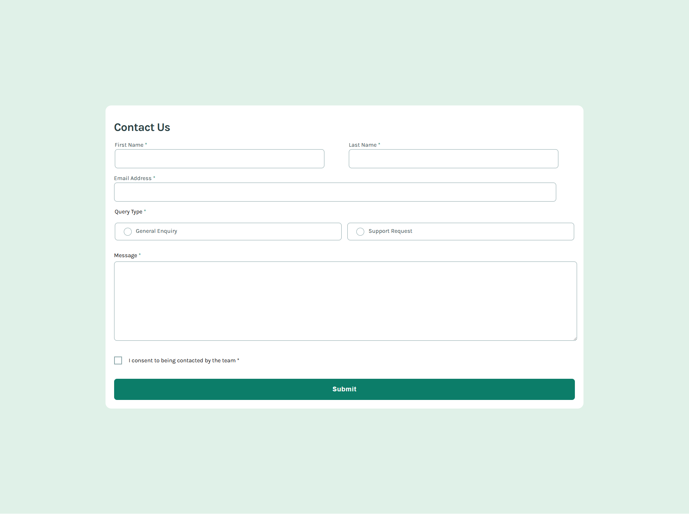

# Contact Form

Esta es una solución al [desafío de Contact Form en Frontend Mentor](https://www.frontendmentor.io/challenges/contact-form--G-hYlqKJj). Los desafíos de Frontend Mentor ayudan a mejorar tus habilidades de programación creando proyectos realistas.

## 🔎 Descripción general

### 📷 Captura de pantalla

### 🔗 Links
- [URL de la solución](https://www.frontendmentor.io/solutions/contact-form-solution-FsKc1LGzfQ)
- [URL del sitio en vivo](https://braismarquez2025.github.io/contact-form/)

### 🔧 Llevado a cabo con
- HTML
- SCSS
- JavaScript

### ✌️ Autor 
- 💼 GitHub - https://github.com/braismarquez2025
- ✉️ Gmail - braismarquez2003@gmail.com
- 👤 Usuario de Frontend - [@braismarquez2025](https://www.frontendmentor.io/profile/braismarquez2025)

